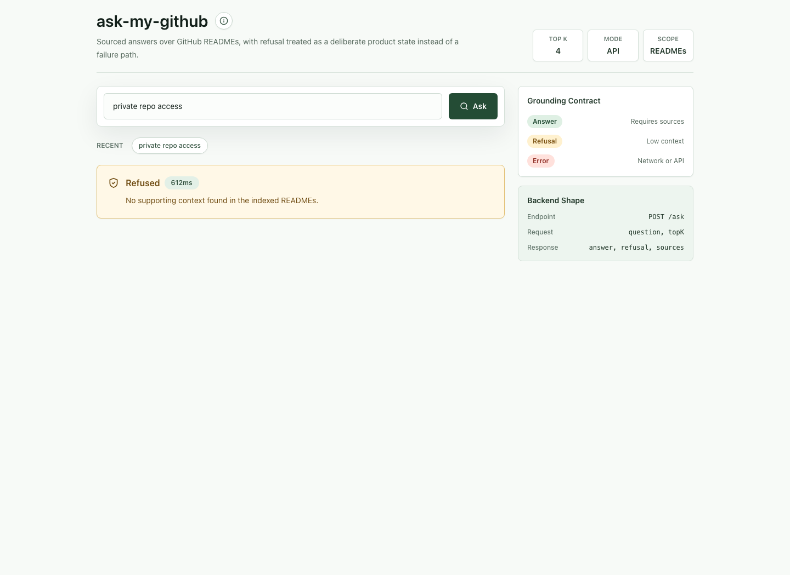

# ask-my-github-ui

A React + TypeScript frontend for [ask-my-github](https://github.com/jneckles/ask-my-github), a small RAG system over GitHub READMEs.



## Why this exists

The backend is a deliberate exercise in eval discipline — deterministic source-file match instead of LLM-as-judge, grounded prompting that refuses on low-context, pytest coverage on the deterministic layers. This UI is the user-facing surface of the same idea: every interaction makes the refusal-vs-answer distinction visible, every answer shows its sources, every retrieval shows its score.

The two ends of the project share one principle: **if the system isn't confident, it should look that way to the user.**

## Stack

- Vite + React 18 + TypeScript (strict)
- Tailwind CSS for styling
- No state-management library — plain `useState`. The UI is small enough that adding Zustand or Redux would be ceremony, not architecture.
- FastAPI backend wired in via `VITE_API_BASE`.

## Local development

```bash
npm install
npm run dev
```

In another terminal from the repository root, start the API:

```bash
python -m src.ingest
ask-api
```

Set `VITE_API_BASE` to point at a deployed backend, or leave it unset to use the local FastAPI server at `localhost:8000`.

You can also open a preloaded demo state with a query string:

```bash
http://localhost:5173/?q=private%20repo%20access
```

## Design choices worth noting

**State as a tagged union** (`src/types.ts` — `AskState`). One state, four shapes, exhaustively handled in `ResultPanel`. Beats four separate booleans and a result object — TypeScript catches the case where you forget to handle "loading."

**Refusal is a first-class response shape, not an error.** The amber refusal panel is visually distinct from the red error panel because they mean different things to the user. An error is "we couldn't reach the system"; a refusal is "the system reached an answer and chose not to give it." Treating those the same hides the grounding behavior that is the whole point of the project.

**Source citations rendered with score visible.** If the model is grounding on a chunk that scored 0.42, the user should see that — it's signal that the answer is on thin ice.

**Recent questions are remembered locally.** The last five questions are stored in `localStorage` and can be re-run from chips, which makes the demo feel like a real work surface instead of a one-shot form.

**Keyboard focus follows familiar command patterns.** `/`, `Cmd-K`, and `Ctrl-K` focus the question box without adding visible chrome to the interface.

**No client-side input validation beyond `trim()`.** Backend already validates and returns structured errors. Duplicating it on the client introduces drift.

## What's missing (documented, not hidden)

- No auth — public demo
- No conversation history — single-turn
- No streaming responses — full answer arrives at once
- No retry on network error (single attempt; user re-submits)

## Deployed demo

[TODO: Vercel URL once shipped]
